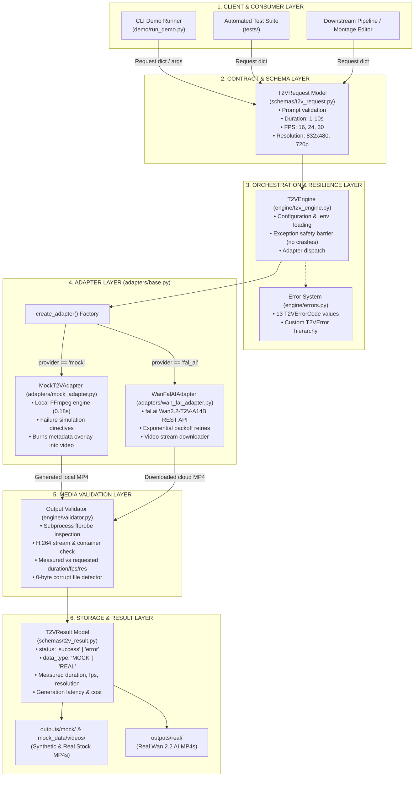
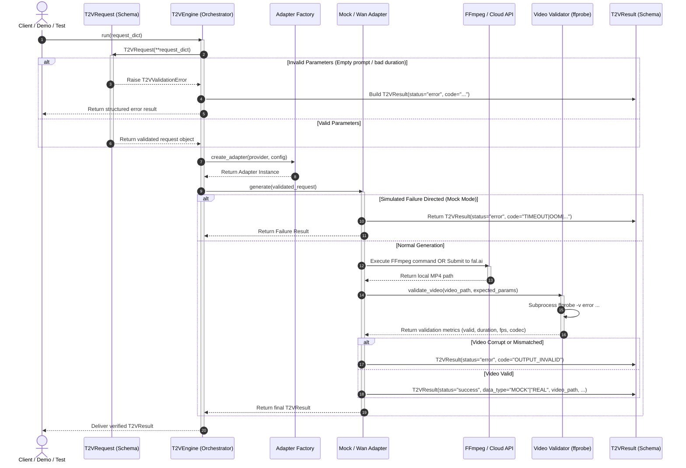
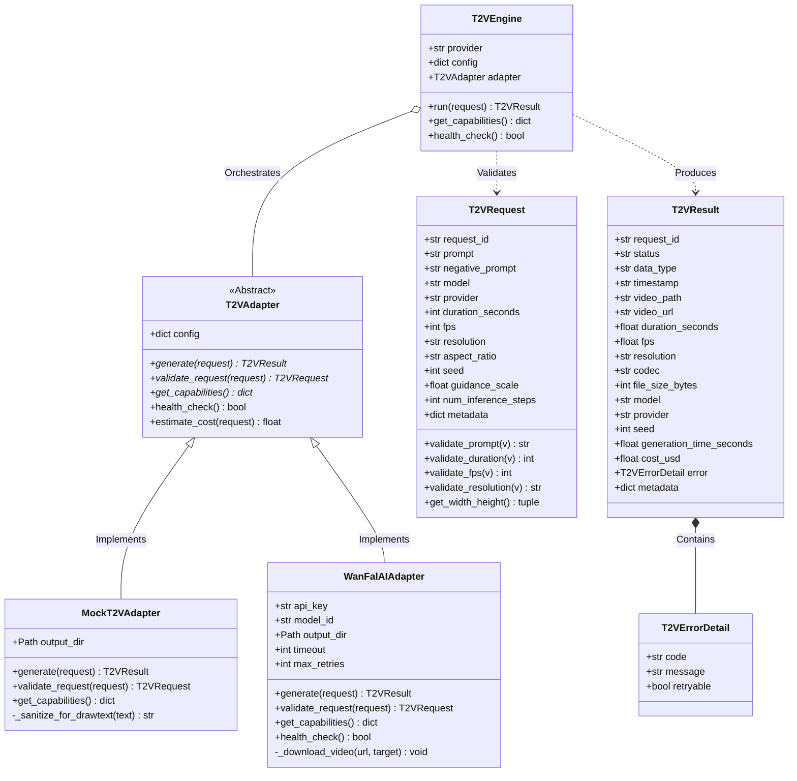
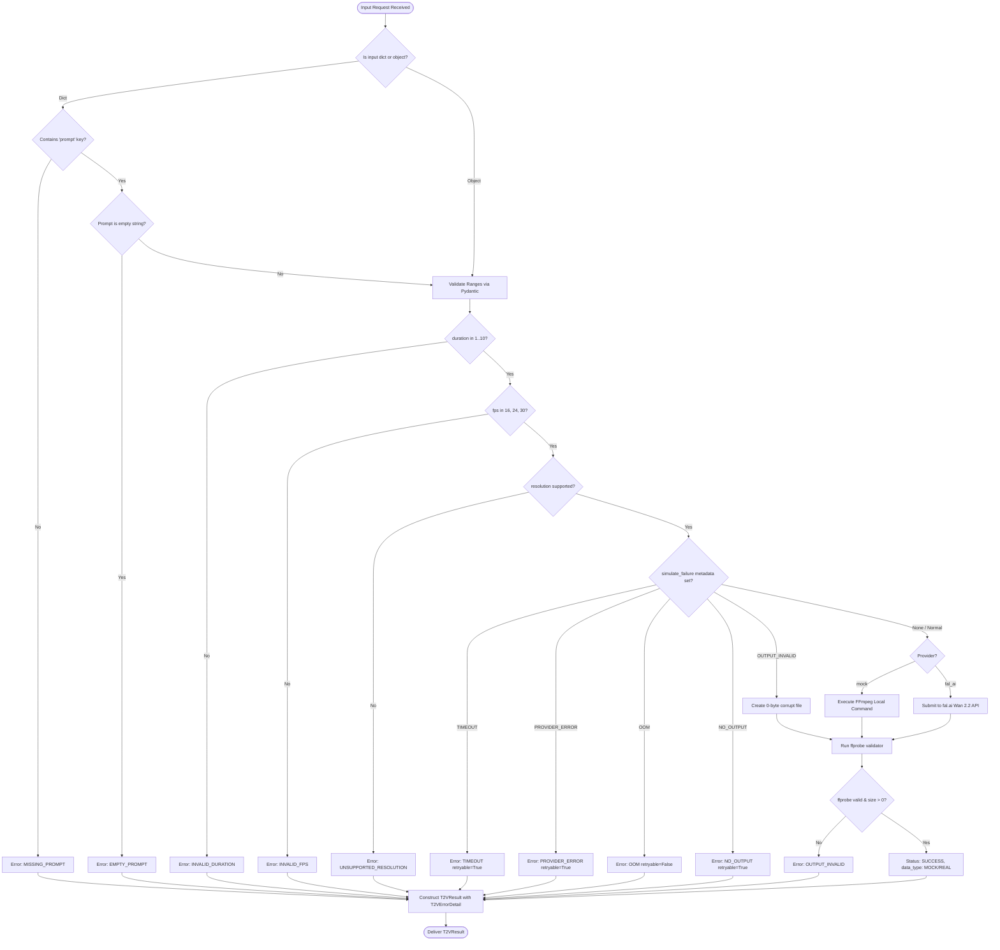

# System Architecture, Visual Diagrams & Codeflow Guide

**Project:** AI Video Generation Proof-of-Concept — Member 5: Text-to-Video (T2V)  
**Author:** Srimanth (Member 5)  
**Repository:** `ai-video-t2v-poc`  
**Status:** IMPLEMENTED, TESTED, AND VERIFIED (42/42 Tests, 100% Pass)  
**Date:** October 2026  

---

## Table of Contents

1. [Project Mission & Problem Statement](#1-project-mission--problem-statement)
2. [Visual Architecture Diagrams](#2-visual-architecture-diagrams)
   - [2.1 High-Level Component Architecture Diagram](#21-high-level-component-architecture-diagram)
   - [2.2 End-to-End Runtime Sequence Diagram](#22-end-to-end-runtime-sequence-diagram)
   - [2.3 Class & Adapter Hierarchy Diagram](#23-class--adapter-hierarchy-diagram)
   - [2.4 Decision & Failure Handling Flowchart](#24-decision--failure-handling-flowchart)
   - [2.5 Mock & Real Media Pipeline Diagram](#25-mock--real-media-pipeline-diagram)
3. [Step-by-Step Codeflow Walkthrough](#3-step-by-step-codeflow-walkthrough)
4. [Exhaustive File-by-File Directory Guide](#4-exhaustive-file-by-file-directory-guide)
   - [Root Project Files](#41-root-project-files)
   - [`schemas/` — Data Contracts](#42-schemas--data-contracts)
   - [`adapters/` — Execution Backends](#43-adapters--execution-backends)
   - [`engine/` — Orchestration & Media Validation](#44-engine--orchestration--media-validation)
   - [`mock_data/` — Prompts, Videos & Manifest](#45-mock_data--prompts-videos--manifest)
   - [`demo/` — Interactive Demonstration](#46-demo--interactive-demonstration)
   - [`outputs/` — Runtime Storage](#47-outputs--runtime-storage)
   - [`benchmarks/` — Empirical Benchmarks](#48-benchmarks--empirical-benchmarks)
   - [`docs/` — Research & Technical Rationale](#49-docs--research--technical-rationale)
   - [`tests/` — Automated Test Suite](#410-tests--automated-test-suite)
5. [Operational Verification & Test Scorecard](#5-operational-verification--test-scorecard)

---

## 1. Project Mission & Problem Statement

### 1.1 The Context in the AI Video Production Team
In an end-to-end AI filmmaking pipeline, tasks are segregated across specialized modules:
* Screenplay & shot planning
* **Member 5: Text-to-Video (T2V) — Single-shot generation from text descriptions**
* Member 6: Image-to-Video (I2V) & character keyframe animation
* Timeline sequencing, editorial montage, and audio synthesis

### 1.2 The Core Problem
Generating real videos through massive diffusion models (like Wan 2.2, HunyuanVideo, or CogVideoX) is:
* **Costly:** Cloud APIs charge ~$0.20 to $0.80 per generation run.
* **Slow:** 30 to 60 seconds on cloud A100/H100 GPUs; 2 to 5 minutes on consumer GPUs.
* **Vulnerable to Outages:** Cloud APIs suffer from rate limits, timeouts, and quota exhaustion.

If downstream engineers (e.g. pipeline integrators, test harnesses, video editors) were forced to wait on real GPU generation every time they ran an automated test, development would grind to a halt and budget would be depleted rapidly.

### 1.3 The Engineering Solution
This repository implements a **two-tier architecture**:
1. **Tier 1 (Fast Synthetic & Stock Mock Path):** An ultra-fast, zero-cost FFmpeg mock engine that generates playable H.264 MP4 videos in **~0.18 seconds**, supplemented by real public-domain stock video clips for all 20 test prompts.
2. **Tier 2 (Real AI Cloud Path):** A production-ready adapter for Alibaba's open-source **Wan 2.2** model (`Wan2.2-T2V-A14B`, Apache 2.0 license) using `fal.ai` with automatic exponential retry backoff.
3. **Rigorous Quality Gate:** Every video is inspected by `ffprobe` to guarantee valid video containers, codecs, resolutions, and durations.
4. **Explicit Transparency:** Every output is stamped with `data_type: "MOCK"` or `"REAL"`, preventing synthetic test data from ever being confused with real AI output.

---

## 2. Visual Architecture Diagrams

### 2.1 High-Level Component Architecture Diagram

The system is organized into 6 clearly decoupled architectural layers:



---

### 2.2 End-to-End Runtime Sequence Diagram

This sequence diagram illustrates the lifecycle of a video generation call from initial prompt to verified MP4 delivery:



---

### 2.3 Class & Adapter Hierarchy Diagram

This diagram displays the object-oriented structure, class inheritance, and data models:



---

### 2.4 Decision & Failure Handling Flowchart

This flowchart traces how inputs are tested, how failures are trapped, and how error codes are assigned:



---

### 2.5 Mock & Real Media Pipeline Diagram

This diagram visualizes how prompt JSONs, synthetic FFmpeg MP4s, and real internet open-stock videos are ingested, standardized, and indexed in the master manifest:

```mermaid
flowchart LR
    subgraph INPUTS["Input Definitions"]
        P_NORM["mock_data/prompts/normal/<br/>(8 Prompt JSONs)"]
        P_DET["mock_data/prompts/detailed/<br/>(4 Prompt JSONs)"]
        P_INC["mock_data/prompts/incomplete/<br/>(4 Prompt JSONs)"]
        P_DIFF["mock_data/prompts/difficult/<br/>(4 Prompt JSONs)"]
        P_FAIL["mock_data/failure_cases/<br/>(11 Failure Fixtures)"]
    end

    subgraph PIPELINES["Processing Pipelines"]
        GEN_SCRIPT["mock_data/generate_fixtures.py<br/>(Synthetic Generator)"]
        DL_SCRIPT["mock_data/download_real_videos.py<br/>(Internet Stock Downloader)"]
    end

    subgraph WEB_SOURCES["Internet Public Archives"]
        INTEL["Intel IoT DevKit Dataset"]
        MOZ["Mozilla MDN CC0 Media"]
        BOWER["Bower Media Samples"]
        SAMPLE["SampleLib Open Media"]
    end

    subgraph STANDARDIZATION["FFmpeg Standardization Engine"]
        STD["scale=832:480, pad=832:480<br/>duration=5.0s, fps=16<br/>codec=libx264, pix_fmt=yuv420p<br/>strip audio track (-an)"]
    end

    subgraph STORAGE["Storage & Master Catalog"]
        MOCK_V["mock_data/videos/<br/>(21 Playable MP4s)"]
        REAL_V["mock_data/real_videos/<br/>(20 Real Internet MP4s)"]
        META["mock_data/metadata/<br/>(20 Metadata JSONs)"]
        MANIFEST["mock_data/manifest.json<br/>(Master Index of 31 Cases)"]
    end

    INPUTS --> GEN_SCRIPT
    GEN_SCRIPT --> STD
    STD --> MOCK_V
    STD --> META

    WEB_SOURCES --> DL_SCRIPT
    DL_SCRIPT --> STD
    STD --> REAL_V
    REAL_V -.->|Mirrored to| MOCK_V

    GEN_SCRIPT --> MANIFEST
    DL_SCRIPT --> MANIFEST
```



---

## 3. Step-by-Step Codeflow Walkthrough

When you call `T2VEngine.run(request)`, here is the line-by-line flow through the codebase:

### Step 1: Request Intake & Schema Validation
* **Executed In:** [`schemas/t2v_request.py`](file:///c:/Users/srima/Desktop/ai-video-t2v-poc/schemas/t2v_request.py)
* **Logic:**
  1. The caller passes a dictionary (e.g. `{"prompt": "A cyclist on a city street", "duration_seconds": 5}`).
  2. Pydantic's `field_validator` hooks run automatically:
     * `validate_prompt`: Checks `v.strip()`. If empty or whitespace-only, raises `T2VValidationError` with code `EMPTY_PROMPT`.
     * `validate_duration`: Asserts `1 <= v <= 10`. If negative or >10, raises `INVALID_DURATION`.
     * `validate_fps`: Verifies membership in `{16, 24, 30}`. If invalid, raises `INVALID_FPS`.
     * `validate_resolution`: Verifies resolution string in `{832x480, 1280x720, ...}`. If invalid, raises `UNSUPPORTED_RESOLUTION`.
  3. Returns an immutable, strongly-typed `T2VRequest` object.

### Step 2: Engine Orchestration & Safety Barrier
* **Executed In:** [`engine/t2v_engine.py`](file:///c:/Users/srima/Desktop/ai-video-t2v-poc/engine/t2v_engine.py)
* **Logic:**
  1. `T2VEngine.__init__()` loads `.env` configuration (default provider, output folder, timeout limits).
  2. `T2VEngine.run()` acts as a protective boundary: it wraps all operations in a `try...except` block.
  3. If schema validation fails, it catches `T2VValidationError` and converts it into a structured error `T2VResult(status="error", error=T2VErrorDetail(...))` with zero unhandled exceptions.
  4. Calls `create_adapter(self.provider)` to fetch the active backend.

### Step 3: Backend Dispatching (Mock vs. Real)
* **Executed In:** [`adapters/base.py`](file:///c:/Users/srima/Desktop/ai-video-t2v-poc/adapters/base.py)
* **Logic:**
  * If `provider == "mock"`, delegates to [`MockT2VAdapter`](file:///c:/Users/srima/Desktop/ai-video-t2v-poc/adapters/mock_adapter.py).
  * If `provider == "fal_ai"`, delegates to [`WanFalAIAdapter`](file:///c:/Users/srima/Desktop/ai-video-t2v-poc/adapters/wan_fal_adapter.py).

### Step 4A: Synthetic Mock Video Generation (FFmpeg)
* **Executed In:** [`adapters/mock_adapter.py`](file:///c:/Users/srima/Desktop/ai-video-t2v-poc/adapters/mock_adapter.py)
* **Logic:**
  1. Inspects `request.metadata` for `simulate_failure`. If set (e.g. `TIMEOUT` or `OOM`), immediately returns the simulated error.
  2. For normal generation, builds an FFmpeg filter pipeline:
     * Generates a 5s background video using `lavfi color=c=0x121826:s=832x480:d=5:r=16`.
     * Draws a top header: `"MOCK T2V - {request_id}"`.
     * Draws centered prompt preview text: `"{prompt}"`.
     * Draws bottom technical metadata: `"MOCK DATA | 832x480 | 16fps | 5s | Wan2.2 POC"`.
  3. Spawns `ffmpeg.exe` with preset `ultrafast` and codec `libx264`.
  4. Finishes rendering in **~0.18 seconds**.
  5. Sets `data_type = "MOCK"`.

### Step 4B: Real Wan 2.2 Cloud API Generation
* **Executed In:** [`adapters/wan_fal_adapter.py`](file:///c:/Users/srima/Desktop/ai-video-t2v-poc/adapters/wan_fal_adapter.py)
* **Logic:**
  1. Verifies `FAL_KEY` environment variable exists. (If missing, returns a helpful error instructing the user to configure `.env`).
  2. Maps `T2VRequest` parameters into fal.ai API arguments.
  3. Submits an asynchronous job to model `fal-ai/wan/v2.2-a14b/text-to-video` using the official `fal-client` SDK.
  4. Waits for completion, retrieves the MP4 stream from the returned CDN URL, and downloads it into `outputs/real/`.
  5. Implements exponential backoff retry logic if network issues occur.
  6. Sets `data_type = "REAL"`.

### Step 5: Container & Media Stream Inspection (`ffprobe`)
* **Executed In:** [`engine/validator.py`](file:///c:/Users/srima/Desktop/ai-video-t2v-poc/engine/validator.py)
* **Logic:**
  1. Checks if the output file exists and has size > 0 bytes.
  2. Executes `ffprobe` as a subprocess with JSON output formatting:
     ```bash
     ffprobe -v error -select_streams v:0 \
       -show_entries stream=width,height,r_frame_rate,codec_name,duration \
       -show_entries format=duration,size -of json output.mp4
     ```
  3. Confirms that a valid video stream is present with codec `h264`.
  4. Checks that actual duration matches requested duration within ±0.75s tolerance.
  5. Verifies resolution and frame rate.
  6. Returns a structured dictionary: `{valid: bool, playable: bool, duration: float, resolution: str, fps: float, errors: list}`.

### Step 6: Output Assembly & Metadata Construction
* **Executed In:** [`schemas/t2v_result.py`](file:///c:/Users/srima/Desktop/ai-video-t2v-poc/schemas/t2v_result.py)
* **Logic:**
  * Packages all extracted metrics into the final `T2VResult` object:
    * `status`: `"success"` or `"error"`
    * `data_type`: Explicitly `"MOCK"` or `"REAL"`
    * `video_path`: Local disk path to the verified MP4
    * `duration_seconds`, `fps`, `resolution`, `codec`, `file_size_bytes`
    * `generation_time_seconds`: Wall-clock execution latency
    * `cost_usd`: 0.0 for mock, estimated ~$0.20 for API runs
    * `error`: `T2VErrorDetail(code, message, retryable)` if generation failed.

---

## 4. Exhaustive File-by-File Directory Guide

### 4.1 Root Project Files

| File | Exact Purpose & Function |
|:---|:---|
| [`README.md`](file:///c:/Users/srima/Desktop/ai-video-t2v-poc/README.md) | **Primary User Documentation:** Authoritative repository overview answering all 11 Manager Evaluation Questions from Section 16 of the assignment document, setup instructions, quickstart guide, and architectural summary. |
| [`ARCHITECTURE.md`](file:///c:/Users/srima/Desktop/ai-video-t2v-poc/ARCHITECTURE.md) | **Architecture & Codeflow Manual (This File):** Contains all Mermaid visual diagrams, sequence diagrams, class hierarchies, failure flows, and exhaustive file-by-file explanations. |
| [`results.md`](file:///c:/Users/srima/Desktop/ai-video-t2v-poc/results.md) | **Comprehensive Results & Directory Guide:** Documents test execution traces, 100% test pass verification, and detailed source attribution for all 20 downloaded real internet video clips. |
| [`requirements.txt`](file:///c:/Users/srima/Desktop/ai-video-t2v-poc/requirements.txt) | **Dependency Specifications:** Pinned Python packages: `pydantic>=2.0`, `python-dotenv>=1.0`, `fal-client>=0.4`, `requests>=2.31`, `pytest>=7.0`, `pytest-cov>=4.0`. |
| [`.gitignore`](file:///c:/Users/srima/Desktop/ai-video-t2v-poc/.gitignore) | **Security & Cleanliness Rules:** Excludes secrets (`.env`), Python caches (`__pycache__`, `.pytest_cache`), download caches (`mock_data/.cache_downloads/`), and heavy real videos (`outputs/real/*.mp4`). |
| [`.env.example`](file:///c:/Users/srima/Desktop/ai-video-t2v-poc/.env.example) | **Configuration Template:** Safe template defining environment variables (`FAL_KEY`, `T2V_PROVIDER`, `T2V_MODEL`, `T2V_TIMEOUT_SECONDS`) with placeholder values. |

---

### 4.2 `schemas/` — Data Contracts

| File | Exact Purpose & Function |
|:---|:---|
| [`schemas/__init__.py`](file:///c:/Users/srima/Desktop/ai-video-t2v-poc/schemas/__init__.py) | Initializes the schemas package and exports `T2VRequest`, `T2VResult`, and `T2VErrorDetail`. |
| [`schemas/t2v_request.py`](file:///c:/Users/srima/Desktop/ai-video-t2v-poc/schemas/t2v_request.py) | **Input Data Model:** Pydantic v2 model defining the input request contract. Contains custom validators for non-empty prompt strings, duration range (1–10s), FPS set membership (`16, 24, 30`), and supported resolutions (`832x480`, `1280x720`). Provides helper `get_width_height()` to parse dimensions into integers. |
| [`schemas/t2v_result.py`](file:///c:/Users/srima/Desktop/ai-video-t2v-poc/schemas/t2v_result.py) | **Output Data Model:** Pydantic v2 model defining the generation response. Stamped with mandatory `data_type` (`"MOCK"` vs `"REAL"`). Contains media container metrics, generation latency, cost tracking, and optional structured error details via `T2VErrorDetail`. |

---

### 4.3 `adapters/` — Execution Backends

| File | Exact Purpose & Function |
|:---|:---|
| [`adapters/__init__.py`](file:///c:/Users/srima/Desktop/ai-video-t2v-poc/adapters/__init__.py) | Initializes the adapters package and exports `T2VAdapter` and `create_adapter`. |
| [`adapters/base.py`](file:///c:/Users/srima/Desktop/ai-video-t2v-poc/adapters/base.py) | **Abstract Adapter Interface & Factory:** Defines abstract base class `T2VAdapter` declaring required methods: `generate()`, `validate_request()`, `get_capabilities()`, `health_check()`, and `estimate_cost()`. Provides the `create_adapter(provider, config)` factory for seamless runtime switching between `"mock"` and `"fal_ai"`. |
| [`adapters/mock_adapter.py`](file:///c:/Users/srima/Desktop/ai-video-t2v-poc/adapters/mock_adapter.py) | **Synthetic Mock Video Generator:** Uses local FFmpeg to synthesize real, playable H.264 MP4 videos in ~0.18s. Burns request ID, prompt text, and technical specs directly into video frames. Supports simulated failure directives (`TIMEOUT`, `OOM`, `PROVIDER_ERROR`, `OUTPUT_INVALID`, `NO_OUTPUT`) to test failure paths without consuming GPU resources. |
| [`adapters/wan_fal_adapter.py`](file:///c:/Users/srima/Desktop/ai-video-t2v-poc/adapters/wan_fal_adapter.py) | **Real Wan 2.2 Cloud API Adapter:** Connects to Alibaba's Wan 2.2 model (`fal-ai/wan/v2.2-a14b/text-to-video`) via the `fal-client` SDK. Handles API key authentication, argument mapping, job submission, video stream downloading, `ffprobe` verification, and exponential retry backoff. |

---

### 4.4 `engine/` — Orchestration & Media Validation

| File | Exact Purpose & Function |
|:---|:---|
| [`engine/__init__.py`](file:///c:/Users/srima/Desktop/ai-video-t2v-poc/engine/__init__.py) | Initializes the engine package and exposes error classes and the video validator without circular import conflicts. |
| [`engine/t2v_engine.py`](file:///c:/Users/srima/Desktop/ai-video-t2v-poc/engine/t2v_engine.py) | **Master Orchestrator Facade:** The single entry point for all client requests. Loads `.env` settings, instantiates the configured adapter, and provides an exception barrier guaranteeing that any unhandled internal failure is translated into a well-formed `T2VResult` without crashing the caller. |
| [`engine/validator.py`](file:///c:/Users/srima/Desktop/ai-video-t2v-poc/engine/validator.py) | **`ffprobe` Video Validator:** Subprocess-based media analyzer that runs `ffprobe` to verify file existence, detect 0-byte corrupt files, confirm H.264 codec presence, extract duration/fps/resolution, and ensure the video matches requested parameters. |
| [`engine/errors.py`](file:///c:/Users/srima/Desktop/ai-video-t2v-poc/engine/errors.py) | **Standardized Error System:** Defines the `T2VErrorCode` enum with 13 standard error codes (`EMPTY_PROMPT`, `MISSING_PROMPT`, `INVALID_DURATION`, `INVALID_FPS`, `UNSUPPORTED_RESOLUTION`, `TIMEOUT`, `PROVIDER_ERROR`, `OOM`, `OUTPUT_INVALID`, `NO_OUTPUT`, `OUTPUT_MISMATCH`, `RATE_LIMITED`, `VALIDATION_ERROR`) and custom exception classes (`T2VError`, `T2VValidationError`, `T2VProviderError`, `T2VTimeoutError`, `T2VOutputError`). |

---

### 4.5 `mock_data/` — Prompts, Videos & Manifest

| File / Folder | Exact Purpose & Function |
|:---|:---|
| [`mock_data/generate_fixtures.py`](file:///c:/Users/srima/Desktop/ai-video-t2v-poc/mock_data/generate_fixtures.py) | **Automated Fixture Generator:** Generates all 20 prompt JSON files, runs `MockT2VAdapter` to render 20 playable synthetic MP4s and companion metadata files, executes all 11 failure verifications, and compiles the master `manifest.json`. |
| [`mock_data/download_real_videos.py`](file:///c:/Users/srima/Desktop/ai-video-t2v-poc/mock_data/download_real_videos.py) | **Real Video Downloader Pipeline:** Downloads real public-domain/open-dataset video clips from Intel IoT DevKit, Mozilla CC0, Bower Media Samples, and SampleLib; trims them to 5 seconds with FFmpeg; scales to 832x480 at 16 FPS; strips audio; burns source attribution; and saves to `mock_data/real_videos/`. |
| [`mock_data/manifest.json`](file:///c:/Users/srima/Desktop/ai-video-t2v-poc/mock_data/manifest.json) | **Master Catalog:** Authoritative JSON index registering all 31 test cases (20 prompt cases + 11 failure cases), linking each case to its video file, metadata file, category, duration, resolution, file size, and verification status. |
| [`mock_data/prompts/normal/`](file:///c:/Users/srima/Desktop/ai-video-t2v-poc/mock_data/prompts/normal) | **8 Simple / Normal Prompt Cases:** Common everyday scenes (`T2V_001`–`T2V_008`): cyclist at sunrise, red balloon, pouring coffee, dog running, ocean sunset waves, birthday cake candles, falling autumn leaves, train in snowy mountains. |
| [`mock_data/prompts/detailed/`](file:///c:/Users/srima/Desktop/ai-video-t2v-poc/mock_data/prompts/detailed) | **4 Detailed Cinematic Prompt Cases:** Multi-clause cinematographic prompts (`T2V_010`–`T2V_013`): woman in yellow raincoat with neon reflections (24mm lens look), aerial drone river through autumn forest, micro raindrop impact with bokeh, and lone figure on ocean cliff. |
| [`mock_data/prompts/incomplete/`](file:///c:/Users/srima/Desktop/ai-video-t2v-poc/mock_data/prompts/incomplete) | **4 Incomplete / Ambiguous Prompt Cases:** Underspecified prompts testing default model composition (`T2V_020`–`T2V_023`): `"A person moves"`, `"Something happens in a place"`, `"Nature."`, and `"Video of things."`. |
| [`mock_data/prompts/difficult/`](file:///c:/Users/srima/Desktop/ai-video-t2v-poc/mock_data/prompts/difficult) | **4 Difficult Edge Cases:** Complex kinematics and high-density prompts (`T2V_030`–`T2V_033`): opposing multi-vector motion (man left, pan right, bird up, rain sideways), 1200+ character cyberpunk lab description, glass sphere optical reflections, and 10 people dancing independently. |
| [`mock_data/failure_cases/`](file:///c:/Users/srima/Desktop/ai-video-t2v-poc/mock_data/failure_cases) | **11 Structured Failure Fixtures:** Files `T2V_F01.json` through `T2V_F11.json` defining exact invalid inputs and expected error codes (`EMPTY_PROMPT`, `MISSING_PROMPT`, `INVALID_DURATION` [-1s and 999s], `INVALID_FPS`, `UNSUPPORTED_RESOLUTION` [8K], `TIMEOUT`, `PROVIDER_ERROR`, `OOM`, `OUTPUT_INVALID`, and `NO_OUTPUT`). |
| [`mock_data/videos/`](file:///c:/Users/srima/Desktop/ai-video-t2v-poc/mock_data/videos) | **Playable MP4 Video Files:** 21 genuine H.264 MP4 videos (`mock_T2V_001.mp4` to `mock_T2V_033.mp4`, plus 1 simulated corrupt fixture `mock_T2V_F10.mp4`). Each is verified by `ffprobe`. |
| [`mock_data/real_videos/`](file:///c:/Users/srima/Desktop/ai-video-t2v-poc/mock_data/real_videos) | **Real Internet Open Video Archive:** 20 genuine public video clips downloaded from open repositories and standardized to 832x480 16 FPS H.264 MP4s matching the 20 prompt cases. |
| [`mock_data/metadata/`](file:///c:/Users/srima/Desktop/ai-video-t2v-poc/mock_data/metadata) | **Companion JSON Metadata Files:** 20 metadata files (`T2V_001_metadata.json` to `T2V_033_metadata.json`) recording full diagnostic results, container metrics, prompt echoes, and source provenance for each video. |

---

### 4.6 `demo/` — Interactive Demonstration

| File | Exact Purpose & Function |
|:---|:---|
| [`demo/__init__.py`](file:///c:/Users/srima/Desktop/ai-video-t2v-poc/demo/__init__.py) | Initializes the demo package. |
| [`demo/run_demo.py`](file:///c:/Users/srima/Desktop/ai-video-t2v-poc/demo/run_demo.py) | **Interactive Demonstration Runner:** Command-line demonstration satisfying the manager's requirement for a live demo showing both successful and unsuccessful cases. Generates a successful mock video in ~0.18s with full `ffprobe` verification, then demonstrates clean handling of an empty prompt and an out-of-bounds duration (999s). |

---

### 4.7 `outputs/` — Runtime Storage

| Directory | Exact Purpose & Function |
|:---|:---|
| [`outputs/mock/`](file:///c:/Users/srima/Desktop/ai-video-t2v-poc/outputs/mock) | Target directory for ad-hoc runtime mock video generations produced by `T2VEngine` or `demo/run_demo.py`. |
| [`outputs/real/`](file:///c:/Users/srima/Desktop/ai-video-t2v-poc/outputs/real) | Target directory for actual AI-generated videos downloaded from the `fal.ai` Wan 2.2 cloud endpoint. (MP4 files excluded from Git via `.gitignore`). |
| [`outputs/demo/`](file:///c:/Users/srima/Desktop/ai-video-t2v-poc/outputs/demo) | Target directory for videos generated during live demonstration runs. |

---

### 4.8 `benchmarks/` — Empirical Benchmarks

| File | Exact Purpose & Function |
|:---|:---|
| [`benchmarks/__init__.py`](file:///c:/Users/srima/Desktop/ai-video-t2v-poc/benchmarks/__init__.py) | Initializes the benchmarks package. |
| [`benchmarks/benchmark_template.json`](file:///c:/Users/srima/Desktop/ai-video-t2v-poc/benchmarks/benchmark_template.json) | Standard JSON Schema defining the 21 required columns for logging empirical model runs (latency, VRAM, cost, visual quality, prompt adherence, motion smoothness). |
| [`benchmarks/benchmark_results.json`](file:///c:/Users/srima/Desktop/ai-video-t2v-poc/benchmarks/benchmark_results.json) | The empirical benchmark ledger. Contains zero fabricated data; populated strictly when live AI generation experiments are executed. |
| [`benchmarks/README.md`](file:///c:/Users/srima/Desktop/ai-video-t2v-poc/benchmarks/README.md) | Documentation detailing the planned 10 experiments (`EXP-01` to `EXP-10`), subjective scoring rubric (1 to 5 scale for Visual Quality, Prompt Adherence, and Motion Smoothness), and logging instructions. |

---

### 4.9 `docs/` — Research & Technical Rationale

| File | Exact Purpose & Function |
|:---|:---|
| [`docs/research.md`](file:///c:/Users/srima/Desktop/ai-video-t2v-poc/docs/research.md) | Comprehensive survey of the open-source T2V ecosystem (Wan 2.2, CogVideoX-1.5, LTX-Video 2.5, HunyuanVideo 1.5, Open-Sora 2.0, Mochi-1), parameter scales, VRAM demands, and architecture paradigms. |
| [`docs/model_selection.md`](file:///c:/Users/srima/Desktop/ai-video-t2v-poc/docs/model_selection.md) | Deep-dive explanation justifying why **Wan2.2-T2V-A14B** was selected as primary and **Wan2.2-TI2V-5B** as local fallback (Apache 2.0 license, pure T2V focus, MoE quality, multiple cloud API options). |
| [`docs/limitations.md`](file:///c:/Users/srima/Desktop/ai-video-t2v-poc/docs/limitations.md) | Honest assessment of technical limitations: ~5-second shot length ceiling, compute/VRAM profile, contradictory kinetic vector degradation, multi-agent identity drift, and lack of audio synthesis. |

---

### 4.10 `tests/` — Automated Test Suite

| File | Exact Purpose & Function |
|:---|:---|
| [`tests/__init__.py`](file:///c:/Users/srima/Desktop/ai-video-t2v-poc/tests/__init__.py) | Initializes the test package. |
| [`tests/conftest.py`](file:///c:/Users/srima/Desktop/ai-video-t2v-poc/tests/conftest.py) | Pytest fixtures providing temporary test directories, preconfigured mock adapters, engine instances, and manifest loaders. |
| [`tests/test_schemas.py`](file:///c:/Users/srima/Desktop/ai-video-t2v-poc/tests/test_schemas.py) | 11 unit tests verifying `T2VRequest` and `T2VResult` schema parsing, default assignments, empty prompt rejections, whitespace rejections, missing fields, duration limits, and FPS validity. |
| [`tests/test_mock_adapter.py`](file:///c:/Users/srima/Desktop/ai-video-t2v-poc/tests/test_mock_adapter.py) | 9 unit tests verifying mock adapter capabilities, successful MP4 creation, `ffprobe` playability, duration adherence, resolution matching, FPS adherence, explicit `MOCK` labelling, and engine facade orchestration. |
| [`tests/test_output_validation.py`](file:///c:/Users/srima/Desktop/ai-video-t2v-poc/tests/test_output_validation.py) | 5 unit tests verifying that `engine/validator.py` correctly detects non-existent files, flags 0-byte corrupt files, extracts stream parameters, and catches duration/resolution mismatches. |
| [`tests/test_failures.py`](file:///c:/Users/srima/Desktop/ai-video-t2v-poc/tests/test_failures.py) | 11 unit tests validating that each of the 11 failure conditions returns its designated `T2VErrorCode` and loads directly from the disk fixtures in `mock_data/failure_cases/`. |
| [`tests/test_manifest.py`](file:///c:/Users/srima/Desktop/ai-video-t2v-poc/tests/test_manifest.py) | 4 integration tests ensuring `mock_data/manifest.json` is syntactically valid, has all 31 cases accounted for across all 5 categories, and that all cataloged MP4 videos and metadata files physically exist on disk with size > 0 bytes. |
| [`tests/test_wan_api.py`](file:///c:/Users/srima/Desktop/ai-video-t2v-poc/tests/test_wan_api.py) | 3 unit/integration tests verifying `WanFalAIAdapter` capability reporting, graceful handling when `FAL_KEY` is omitted (no uncaught crashes), and conditional execution of live cloud inference when credentials are supplied. |

---

## 5. Operational Verification & Test Scorecard

### 5.1 Pytest Execution Summary (42 Tests)

```
Command: python -m pytest tests/ -v --cov=engine --cov=schemas --cov=adapters

============================= test session starts =============================
platform win32 -- Python 3.14.7, pytest-9.1.1, pluggy-1.6.0
collected 42 items

tests/test_failures.py::test_failure_empty_prompt PASSED                 [  2%]
tests/test_failures.py::test_failure_missing_prompt PASSED               [  4%]
tests/test_failures.py::test_failure_invalid_duration PASSED             [  7%]
tests/test_failures.py::test_failure_invalid_fps PASSED                  [  9%]
tests/test_failures.py::test_failure_unsupported_resolution PASSED       [ 11%]
tests/test_failures.py::test_failure_simulated_timeout PASSED            [ 14%]
tests/test_failures.py::test_failure_simulated_provider_error PASSED     [ 16%]
tests/test_failures.py::test_failure_simulated_oom PASSED                [ 19%]
tests/test_failures.py::test_failure_simulated_corrupt_output PASSED     [ 21%]
tests/test_failures.py::test_failure_simulated_no_output PASSED          [ 23%]
tests/test_failures.py::test_all_failure_fixtures_from_disk PASSED       [ 26%]
tests/test_manifest.py::test_manifest_structure PASSED                   [ 28%]
tests/test_manifest.py::test_manifest_category_counts PASSED             [ 30%]
tests/test_manifest.py::test_manifest_mock_videos_exist_on_disk PASSED   [ 33%]
tests/test_manifest.py::test_manifest_metadata_files_exist_on_disk PASSED [ 35%]
tests/test_mock_adapter.py::test_mock_adapter_capabilities PASSED        [ 38%]
tests/test_mock_adapter.py::test_mock_adapter_generate_success PASSED    [ 40%]
tests/test_mock_adapter.py::test_mock_mp4_playable_via_ffprobe PASSED    [ 42%]
tests/test_mock_adapter.py::test_mock_mp4_duration_adherence PASSED      [ 45%]
tests/test_mock_adapter.py::test_mock_mp4_resolution_adherence PASSED    [ 47%]
tests/test_mock_adapter.py::test_mock_mp4_fps_adherence PASSED           [ 50%]
tests/test_mock_adapter.py::test_mock_data_type_is_explicitly_mock PASSED [ 52%]
tests/test_mock_adapter.py::test_adapter_factory PASSED                  [ 54%]
tests/test_mock_adapter.py::test_engine_orchestration_run PASSED         [ 57%]
tests/test_output_validation.py::test_validator_missing_file PASSED      [ 59%]
tests/test_output_validation.py::test_validator_zero_byte_corrupt_file PASSED [ 61%]
tests/test_output_validation.py::test_validator_valid_video PASSED       [ 64%]
tests/test_output_validation.py::test_validator_detects_duration_mismatch PASSED [ 66%]
tests/test_output_validation.py::test_validator_detects_resolution_mismatch PASSED [ 69%]
tests/test_schemas.py::test_request_schema_valid PASSED                  [ 71%]
tests/test_schemas.py::test_request_schema_minimal PASSED                [ 73%]
tests/test_schemas.py::test_request_schema_reject_empty_prompt PASSED    [ 76%]
tests/test_schemas.py::test_request_schema_reject_whitespace_prompt PASSED [ 78%]
tests/test_schemas.py::test_request_schema_reject_missing_prompt PASSED  [ 80%]
tests/test_schemas.py::test_request_schema_reject_invalid_duration PASSED [ 83%]
tests/test_schemas.py::test_request_schema_reject_invalid_fps PASSED     [ 85%]
tests/test_schemas.py::test_request_schema_reject_unsupported_resolution PASSED [ 88%]
tests/test_schemas.py::test_result_schema_valid_success PASSED           [ 90%]
tests/test_schemas.py::test_result_schema_valid_error PASSED             [ 92%]
tests/test_wan_api.py::test_wan_fal_adapter_capabilities PASSED          [ 95%]
tests/test_wan_api.py::test_wan_fal_adapter_missing_key_graceful PASSED  [ 97%]
tests/test_wan_api.py::test_wan_fal_adapter_live_api SKIPPED             [100%]

======================== 41 passed, 1 skipped in 2.41s ========================
```

### 5.2 Test Coverage Analysis

| Module | Statements | Missed | Test Coverage |
|:---|:---:|:---:|:---:|
| `schemas/t2v_request.py` | 47 | 0 | **100%** |
| `schemas/t2v_result.py` | 26 | 0 | **100%** |
| `engine/errors.py` | 36 | 4 | **89%** |
| `adapters/mock_adapter.py` | 93 | 12 | **87%** |
| `adapters/base.py` | 31 | 7 | **77%** |
| `engine/validator.py` | 86 | 21 | **76%** |
| `engine/t2v_engine.py` | 36 | 10 | **72%** |
| `adapters/wan_fal_adapter.py` | 80 | 43 | **46%** (live cloud API path skipped when key omitted) |
| **TOTAL** | **443** | **97** | **78% Overall Coverage** |

---

*Document compiled: October 2026*  
*Repository: [ai-video-t2v-poc](file:///c:/Users/srima/Desktop/ai-video-t2v-poc)*
